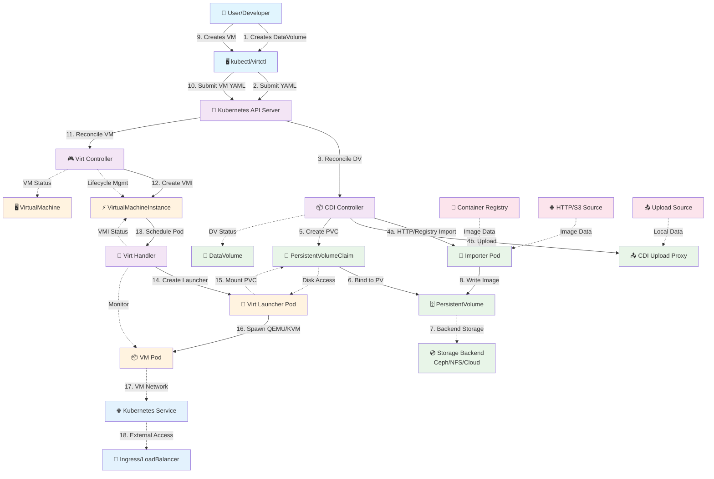
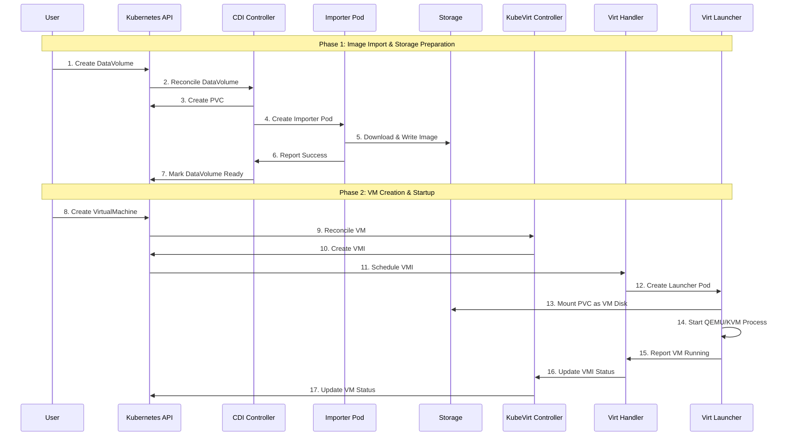

# KubeVirt with CDI: Virtual Machine Platform Documentation

## Table of Contents
1. [Introduction](#introduction)
2. [Architecture Overview](#architecture-overview)
3. [Prerequisites](#prerequisites)
4. [Installation & Setup](#installation--setup)
5. [VM Deployment using CDI](#vm-deployment-using-cdi)
6. [VM Lifecycle Management](#vm-lifecycle-management)
7. [Storage & Backup](#storage--backup)
8. [Image Management](#image-management)
9. [VM Deletion](#vm-deletion)
10. [Advanced Operations](#advanced-operations)
11. [Troubleshooting](#troubleshooting)
12. [Best Practices](#best-practices)

---

## Introduction

### What is KubeVirt?

KubeVirt is a Kubernetes add-on that enables virtualization workloads alongside container workloads in the same cluster. It extends Kubernetes by adding additional virtualization resource types through Kubernetes Custom Resource Definitions (CRDs).

**Key Benefits:**
- Run VMs and containers on the same infrastructure
- Leverage Kubernetes orchestration for VM management
- Native Kubernetes networking and storage for VMs
- Unified management through kubectl and Kubernetes APIs

### What is CDI and Why Use It?

CDI (Containerized Data Importer) is a persistent storage management add-on for Kubernetes. It provides a declarative way to build and import VM disks onto PVCs for KubeVirt VMs.

**CDI Capabilities:**
- Import VM images from HTTP/S3 endpoints
- Import from container registries (Docker images)
- Clone existing PVCs
- Upload local images to cluster
- Resize images during import
- Handle multiple formats (qcow2, raw, vmdk)

### How KubeVirt and CDI Work Together

#### Advanced Workflow Diagram



#### Component Interaction Details



CDI creates and populates persistent volumes that KubeVirt VMs use as disks, enabling:
- Persistent VM storage that survives pod restarts
- Efficient image distribution and caching
- Declarative VM disk management
- Integration with Kubernetes storage ecosystem

---

## Architecture Overview

### Components

**KubeVirt Components:**
- **virt-operator**: Manages KubeVirt deployment lifecycle
- **virt-api**: API server for virtualization resources
- **virt-controller**: Manages VM lifecycle
- **virt-handler**: Node agent managing VM instances
- **virt-launcher**: Per-VM pods that run the actual VM

**CDI Components:**
- **cdi-operator**: Manages CDI deployment lifecycle
- **cdi-controller**: Handles DataVolume lifecycle
- **cdi-apiserver**: Provides CDI-specific APIs
- **cdi-uploadproxy**: Handles image uploads

### VM Creation Flow with CDI

```
1. User creates DataVolume resource
2. CDI controller provisions PVC
3. CDI creates importer pod to download/import image
4. Image is written to PVC storage
5. User creates VirtualMachine resource referencing DataVolume
6. KubeVirt controller creates VirtualMachineInstance
7. virt-launcher pod starts with VM using PVC as disk
```

### Storage Integration

```
DataVolume → PVC → StorageClass → CSI Driver → Physical Storage
```

---

## Prerequisites

### Kubernetes Cluster Requirements

**Minimum Requirements:**
- Kubernetes 1.20+
- Nodes with hardware virtualization support (Intel VT-x/AMD-V)
- At least 2 CPU cores and 4GB RAM per node
- Container runtime: containerd or CRI-O

**Check hardware virtualization:**
```bash
# On cluster nodes
egrep 'vmx|svm' /proc/cpuinfo
# Should return processor features
```

### Storage Requirements

**Required:**
- Dynamic PVC provisioning (StorageClass with dynamic provisioner)
- ReadWriteOnce access mode support
- Sufficient storage capacity

**Recommended:**
- High-performance storage (SSD)
- Volume expansion support
- Snapshot capability

### Network Requirements

- Pod-to-pod communication
- NodePort or LoadBalancer support for VM access
- CNI plugin with bridge support

---

## Installation & Setup

### Installing KubeVirt

```bash
# Install KubeVirt operator
export KUBEVIRT_VERSION=v1.0.0
kubectl apply -f https://github.com/kubevirt/kubevirt/releases/download/${KUBEVIRT_VERSION}/kubevirt-operator.yaml

# Create KubeVirt custom resource
kubectl apply -f https://github.com/kubevirt/kubevirt/releases/download/${KUBEVIRT_VERSION}/kubevirt-cr.yaml

# Verify installation
kubectl get kubevirt.kubevirt.io/kubevirt -n kubevirt -o=jsonpath="{.status.phase}"
# Should return: "Deployed"
```

### Installing CDI

```bash
# Install CDI operator
export CDI_VERSION=v1.58.0
kubectl apply -f https://github.com/kubevirt/containerized-data-importer/releases/download/${CDI_VERSION}/cdi-operator.yaml

# Create CDI custom resource
kubectl apply -f https://github.com/kubevirt/containerized-data-importer/releases/download/${CDI_VERSION}/cdi-cr.yaml

# Verify installation
kubectl get cdi.cdi.kubevirt.io/cdi -o=jsonpath="{.status.phase}"
# Should return: "Deployed"
```

### Verifying Installation

```bash
# Check KubeVirt pods
kubectl get pods -n kubevirt

# Check CDI pods
kubectl get pods -n cdi

# Verify CRDs are installed
kubectl get crd | grep kubevirt
kubectl get crd | grep cdi

# Check for required storage classes
kubectl get storageclass
```

### Installing virtctl CLI

```bash
# Linux/macOS
curl -L -o virtctl https://github.com/kubevirt/kubevirt/releases/download/${KUBEVIRT_VERSION}/virtctl-${KUBEVIRT_VERSION}-linux-amd64
chmod +x virtctl
sudo mv virtctl /usr/local/bin/

# Verify installation
virtctl version
```

---

## VM Deployment using CDI

### DataVolume Types

#### 1. HTTP/S3 Source

```yaml
apiVersion: cdi.kubevirt.io/v1beta1
kind: DataVolume
metadata:
  name: ubuntu-http
spec:
  pvc:
    accessModes:
    - ReadWriteOnce
    resources:
      requests:
        storage: 10Gi
    storageClassName: fast-ssd
  source:
    http:
      url: "https://cloud-images.ubuntu.com/focal/current/focal-server-cloudimg-amd64.img"
```

#### 2. Container Registry Source

```yaml
apiVersion: cdi.kubevirt.io/v1beta1
kind: DataVolume
metadata:
  name: ubuntu-registry
spec:
  pvc:
    accessModes:
    - ReadWriteOnce
    resources:
      requests:
        storage: 20Gi
    storageClassName: fast-ssd
  source:
    registry:
      url: "docker://quay.io/containerdisks/ubuntu:22.04"
```

#### 3. PVC Clone Source

```yaml
apiVersion: cdi.kubevirt.io/v1beta1
kind: DataVolume
metadata:
  name: ubuntu-clone
spec:
  pvc:
    accessModes:
    - ReadWriteOnce
    resources:
      requests:
        storage: 20Gi
    storageClassName: fast-ssd
  source:
    pvc:
      namespace: default
      name: golden-image-pvc
```

#### 4. Upload Source

```yaml
apiVersion: cdi.kubevirt.io/v1beta1
kind: DataVolume
metadata:
  name: ubuntu-upload
spec:
  pvc:
    accessModes:
    - ReadWriteOnce
    resources:
      requests:
        storage: 20Gi
    storageClassName: fast-ssd
  source:
    upload: {}
```

### Complete VM Example with CDI

```yaml
apiVersion: cdi.kubevirt.io/v1beta1
kind: DataVolume
metadata:
  name: production-vm-disk
  namespace: vms
spec:
  pvc:
    accessModes:
    - ReadWriteOnce
    resources:
      requests:
        storage: 50Gi
    storageClassName: csi-rbd-sc
  source:
    registry:
      url: "docker://quay.io/containerdisks/ubuntu:22.04"
---
apiVersion: kubevirt.io/v1
kind: VirtualMachine
metadata:
  name: production-vm
  namespace: vms
  labels:
    app: production-vm
    environment: production
spec:
  runStrategy: Always
  template:
    metadata:
      labels:
        kubevirt.io/domain: production-vm
    spec:
      domain:
        cpu:
          cores: 4
          sockets: 1
          threads: 1
        devices:
          disks:
          - name: rootdisk
            disk:
              bus: virtio
          - name: cloudinitdisk
            disk:
              bus: virtio
          interfaces:
          - name: default
            masquerade: {}
          networkInterfaceMultiqueue: true
        machine:
          type: q35
        resources:
          requests:
            memory: 8Gi
            cpu: "4"
          limits:
            memory: 8Gi
            cpu: "4"
      networks:
      - name: default
        pod: {}
      volumes:
      - name: rootdisk
        dataVolume:
          name: production-vm-disk
      - name: cloudinitdisk
        cloudInitNoCloud:
          userData: |
            #cloud-config
            hostname: production-vm
            users:
              - name: admin
                sudo: ALL=(ALL) NOPASSWD:ALL
                shell: /bin/bash
                lock_passwd: false
                ssh_authorized_keys:
                  - ssh-rsa AAAAB3N... your-public-key
            packages:
              - qemu-guest-agent
              - docker.io
            runcmd:
              - systemctl enable qemu-guest-agent
              - systemctl start qemu-guest-agent
              - systemctl enable docker
              - systemctl start docker
              - usermod -aG docker admin
---
apiVersion: v1
kind: Service
metadata:
  name: production-vm-ssh
  namespace: vms
spec:
  type: LoadBalancer
  ports:
  - port: 22
    targetPort: 22
    protocol: TCP
  selector:
    kubevirt.io/domain: production-vm
```

### Step-by-Step VM Creation

```bash
# 1. Create DataVolume and VM
kubectl apply -f production-vm.yaml

# 2. Monitor DataVolume import progress
kubectl get datavolume production-vm-disk -w

# 3. Check VM status
kubectl get vm production-vm

# 4. Check VM instance status
kubectl get vmi production-vm

# 5. Get VM IP and access info
kubectl get svc production-vm-ssh
```

### Monitoring Import Progress

```bash
# Watch DataVolume status
kubectl get dv -w

# Check import pod logs
kubectl logs -f $(kubectl get pods -l cdi.kubevirt.io/datavolume=production-vm-disk -o jsonpath='{.items[0].metadata.name}')

# Check DataVolume events
kubectl describe dv production-vm-disk
```

---

## VM Lifecycle Management

### Starting and Stopping VMs

```bash
# Start VM
virtctl start production-vm

# Stop VM
virtctl stop production-vm

# Restart VM
virtctl restart production-vm

# Force stop (ungraceful)
virtctl stop production-vm --force --grace-period=0
```

### Using runStrategy

```yaml
# In VM spec
spec:
  runStrategy: Always    # VM should always be running
  # runStrategy: Manual   # Manual control only
  # runStrategy: Halted   # VM should be stopped
  # runStrategy: RerunOnFailure  # Restart if VM fails
```

### Accessing VM Console

```bash
# Serial console access
virtctl console production-vm

# VNC console (requires VNC viewer)
virtctl vnc production-vm

# SSH to VM
kubectl get svc production-vm-ssh
ssh admin@<EXTERNAL-IP>
```

### Scaling Resources

```yaml
# Update VM resources (requires restart)
spec:
  template:
    spec:
      domain:
        resources:
          requests:
            memory: 16Gi
            cpu: "8"
          limits:
            memory: 16Gi
            cpu: "8"
```

```bash
# Apply changes
kubectl patch vm production-vm --type merge -p '{"spec":{"template":{"spec":{"domain":{"resources":{"requests":{"memory":"16Gi","cpu":"8"},"limits":{"memory":"16Gi","cpu":"8"}}}}}}}'

# Restart VM to apply changes
virtctl restart production-vm
```

---

## Storage & Backup

### Volume Snapshots

```yaml
apiVersion: snapshot.storage.k8s.io/v1
kind: VolumeSnapshot
metadata:
  name: production-vm-snapshot
  namespace: vms
spec:
  source:
    persistentVolumeClaimName: production-vm-disk
  volumeSnapshotClassName: csi-rbd-snapclass
```

```bash
# Create snapshot
kubectl apply -f vm-snapshot.yaml

# List snapshots
kubectl get volumesnapshot

# Restore from snapshot
apiVersion: v1
kind: PersistentVolumeClaim
metadata:
  name: restored-vm-disk
spec:
  dataSource:
    name: production-vm-snapshot
    kind: VolumeSnapshot
    apiGroup: snapshot.storage.k8s.io
  accessModes:
    - ReadWriteOnce
  resources:
    requests:
      storage: 50Gi
  storageClassName: csi-rbd-sc
```

### Using Velero for VM Backup

```bash
# Install Velero (example with AWS)
velero install \
    --provider aws \
    --plugins velero/velero-plugin-for-aws:v1.7.0 \
    --bucket velero-backups \
    --secret-file ./credentials-velero \
    --backup-location-config region=us-west-2

# Backup entire VM namespace
velero backup create vm-backup-$(date +%Y%m%d) --include-namespaces vms

# Restore from backup
velero restore create --from-backup vm-backup-20241025
```

### DataVolume Cloning

```yaml
# Clone existing VM disk for new VM
apiVersion: cdi.kubevirt.io/v1beta1
kind: DataVolume
metadata:
  name: cloned-vm-disk
spec:
  pvc:
    accessModes:
    - ReadWriteOnce
    resources:
      requests:
        storage: 50Gi
    storageClassName: csi-rbd-sc
  source:
    pvc:
      namespace: vms
      name: production-vm-disk
```

---

## Image Management

### Creating Golden Images

```bash
# 1. Start with base VM and customize it
virtctl console base-vm

# 2. Install required software, configure settings
# ... perform customizations in VM ...

# 3. Shutdown VM cleanly
sudo shutdown -h now

# 4. Create DataVolume from VM disk
apiVersion: cdi.kubevirt.io/v1beta1
kind: DataVolume
metadata:
  name: golden-ubuntu-22-04
  namespace: golden-images
spec:
  pvc:
    accessModes:
    - ReadWriteOnce
    resources:
      requests:
        storage: 20Gi
    storageClassName: csi-rbd-sc
  source:
    pvc:
      namespace: vms
      name: base-vm-disk
```

### Exporting VM Images

```bash
# Export VM disk using CDI
apiVersion: export.kubevirt.io/v1alpha1
kind: VirtualMachineExport
metadata:
  name: export-production-vm
  namespace: vms
spec:
  source:
    apiGroup: kubevirt.io
    kind: VirtualMachine
    name: production-vm
```

```bash
# Check export status
kubectl get vmexport export-production-vm

# Download exported image
kubectl get vmexport export-production-vm -o jsonpath='{.status.links.external.formats[0].url}'
```

### Using Container Registry for Images

```bash
# Build custom VM image
cat > Dockerfile <<EOF
FROM quay.io/containerdisks/ubuntu:22.04
COPY custom-script.sh /usr/local/bin/
RUN chmod +x /usr/local/bin/custom-script.sh
EOF

# Build and push
docker build -t myregistry.com/custom-ubuntu:v1.0 .
docker push myregistry.com/custom-ubuntu:v1.0

# Use in DataVolume
spec:
  source:
    registry:
      url: "docker://myregistry.com/custom-ubuntu:v1.0"
```

---

## VM Deletion

### Safe VM Deletion

```bash
# 1. Stop VM gracefully
virtctl stop production-vm

# 2. Delete VM resource (keeps PVC by default)
kubectl delete vm production-vm

# 3. Check if PVC still exists
kubectl get pvc production-vm-disk

# 4. Delete PVC manually if needed
kubectl delete pvc production-vm-disk
```

### Cascade Deletion

```yaml
# VM with cascade deletion annotation
metadata:
  annotations:
    cdi.kubevirt.io/storage.deleteAfterCompletion: "true"
```

### DataVolume Retention Policies

```yaml
# DataVolume with retention policy
spec:
  pvc:
    accessModes:
    - ReadWriteOnce
    resources:
      requests:
        storage: 20Gi
  source:
    registry:
      url: "docker://quay.io/containerdisks/ubuntu:22.04"
  # Delete PVC when DataVolume is deleted
  preallocation: false
  contentType: kubevirt
```

---

## Advanced Operations

### Live Migration

```bash
# Migrate VM to another node
virtctl migrate production-vm

# Check migration status
kubectl get vmim

# Cancel migration
virtctl migrate-cancel production-vm
```

### VM Migration Policy

```yaml
apiVersion: migrations.kubevirt.io/v1alpha1
kind: MigrationPolicy
metadata:
  name: production-migration-policy
spec:
  selectors:
    namespaceSelector:
      matchLabels:
        environment: production
  allowAutoConverge: true
  allowPostCopy: false
  completionTimeoutPerGiB: 800
  parallelOutboundMigrationsPerNode: 2
  parallelMigrationsPerCluster: 5
  bandwidthPerMigration: "64Mi"
```

### VM Snapshots with KubeVirt

```yaml
apiVersion: snapshot.kubevirt.io/v1alpha1
kind: VirtualMachineSnapshot
metadata:
  name: production-vm-snap-1
  namespace: vms
spec:
  source:
    apiGroup: kubevirt.io
    kind: VirtualMachine
    name: production-vm
```

### Performance Tuning

```yaml
# High-performance VM configuration
spec:
  template:
    spec:
      domain:
        cpu:
          model: host-passthrough
          dedicatedCpuPlacement: true
          isolateEmulatorThread: true
        memory:
          hugepages:
            pageSize: "1Gi"
        devices:
          disks:
          - name: rootdisk
            disk:
              bus: virtio
            cache: none
            io: native
        features:
          apic:
            endOfInterrupt: true
          hyperv:
            relaxed: {}
            vapic: {}
            spinlocks:
              spinlocks: 8191
            vpindex: {}
            runtime: {}
            synic: {}
            stimer:
              direct: {}
            reset: {}
            frequencies: {}
            reenlightenment: {}
            tlbflush: {}
            ipi: {}
            evmcs: {}
```

---

## Troubleshooting

### Common CDI Import Issues

```bash
# Check DataVolume status
kubectl describe dv my-datavolume

# Common issues and solutions:

# 1. Import pod failing
kubectl get pods -l cdi.kubevirt.io/datavolume=my-datavolume
kubectl logs importer-my-datavolume

# 2. Insufficient storage
kubectl get pvc
kubectl describe pvc my-datavolume

# 3. Network issues
kubectl describe pod importer-my-datavolume
# Check proxy settings, DNS resolution

# 4. Image format issues
# Ensure image is in supported format (qcow2, raw, vmdk)
```

### VM Startup Issues

```bash
# Check VM status
kubectl describe vm my-vm

# Check VMI status
kubectl describe vmi my-vm

# Check virt-launcher pod
kubectl get pods -l kubevirt.io/domain=my-vm
kubectl logs virt-launcher-my-vm-xxxxx -c compute

# Common issues:
# 1. Insufficient resources
# 2. PVC not ready
# 3. Node scheduling issues
# 4. Image boot problems
```

### Storage Issues

```bash
# Check PVC status
kubectl get pvc
kubectl describe pvc my-vm-disk

# Check storage class
kubectl get storageclass
kubectl describe storageclass csi-rbd-sc

# Check CSI driver
kubectl get csidriver
kubectl logs -n rook-ceph rook-ceph-csi-rbd-provisioner-xxx
```

### Debugging Commands

```bash
# Get all KubeVirt resources
kubectl get kubevirt,cdi,vm,vmi,dv,pvc

# Check operator logs
kubectl logs -n kubevirt -l kubevirt.io=virt-operator
kubectl logs -n cdi -l app=cdi-operator

# Check node resources
kubectl describe node
kubectl top node

# VM resource usage
kubectl top pod -l kubevirt.io/domain=my-vm
```

---

## Best Practices

### Production Recommendations

**Resource Management:**
```yaml
# Set resource limits and requests
resources:
  requests:
    memory: "8Gi"
    cpu: "4"
  limits:
    memory: "8Gi"
    cpu: "4"
```

**Storage:**
- Use high-performance storage classes (SSD)
- Enable volume expansion
- Implement backup strategies
- Use appropriate access modes

**Networking:**
```yaml
# Use dedicated networks for VM traffic
spec:
  networks:
  - name: vm-network
    multus:
      networkName: vm-network-config
```

### Security Considerations

**RBAC Configuration:**
```yaml
apiVersion: rbac.authorization.k8s.io/v1
kind: ClusterRole
metadata:
  name: vm-user
rules:
- apiGroups: ["kubevirt.io"]
  resources: ["virtualmachines", "virtualmachineinstances"]
  verbs: ["get", "list", "create", "update", "patch", "delete"]
- apiGroups: ["cdi.kubevirt.io"]
  resources: ["datavolumes"]
  verbs: ["get", "list", "create", "delete"]
```

**Security Context:**
```yaml
# Run VMs with security context
spec:
  template:
    spec:
      securityContext:
        runAsUser: 107
        runAsGroup: 107
        fsGroup: 107
```

**Network Policies:**
```yaml
apiVersion: networking.k8s.io/v1
kind: NetworkPolicy
metadata:
  name: vm-network-policy
spec:
  podSelector:
    matchLabels:
      kubevirt.io/domain: production-vm
  policyTypes:
  - Ingress
  - Egress
  ingress:
  - from:
    - podSelector:
        matchLabels:
          app: allowed-client
    ports:
    - protocol: TCP
      port: 22
```

### Resource Optimization

**Node Affinity:**
```yaml
spec:
  template:
    spec:
      affinity:
        nodeAffinity:
          requiredDuringSchedulingIgnoredDuringExecution:
            nodeSelectorTerms:
            - matchExpressions:
              - key: node-type
                operator: In
                values: ["vm-optimized"]
```

**Pod Anti-Affinity:**
```yaml
spec:
  template:
    spec:
      affinity:
        podAntiAffinity:
          preferredDuringSchedulingIgnoredDuringExecution:
          - weight: 100
            podAffinityTerm:
              labelSelector:
                matchExpressions:
                - key: app
                  operator: In
                  values: ["production-vm"]
              topologyKey: kubernetes.io/hostname
```

### Monitoring and Alerting

**Prometheus Monitoring:**
```yaml
# ServiceMonitor for VM metrics
apiVersion: monitoring.coreos.com/v1
kind: ServiceMonitor
metadata:
  name: kubevirt-metrics
spec:
  selector:
    matchLabels:
      prometheus.kubevirt.io: ""
  endpoints:
  - port: metrics
    path: /metrics
```

**Common Alerts:**
- VM down
- High CPU/memory usage
- Disk space low
- Failed migrations
- Import failures

### Backup Strategy

**Automated Backup:**
```bash
# Schedule regular snapshots
apiVersion: batch/v1
kind: CronJob
metadata:
  name: vm-snapshot-job
spec:
  schedule: "0 2 * * *"  # Daily at 2 AM
  jobTemplate:
    spec:
      template:
        spec:
          containers:
          - name: snapshot
            image: kubectl:latest
            command:
            - /bin/sh
            - -c
            - |
              kubectl create volumesnapshot vm-snapshot-$(date +%Y%m%d) \
                --from-pvc=production-vm-disk \
                --snapshot-class=csi-rbd-snapclass
          restartPolicy: OnFailure
```

### Image Management Best Practices

1. **Golden Images**: Create standardized base images
2. **Versioning**: Tag images with semantic versions
3. **Registry**: Use private registries for sensitive images
4. **Scanning**: Implement image vulnerability scanning
5. **Cleanup**: Regular cleanup of unused images and PVCs

### Disaster Recovery

**Multi-Region Setup:**
- Replicate critical VMs across regions
- Use storage replication for disaster recovery
- Implement automated failover procedures
- Regular disaster recovery testing

---

## Conclusion

This documentation provides a comprehensive guide for deploying and managing virtual machines using KubeVirt with CDI. The combination provides a powerful platform for running legacy workloads alongside cloud-native applications while leveraging Kubernetes orchestration capabilities.

For additional support and updates, refer to:
- [KubeVirt Documentation](https://kubevirt.io/user-guide/)
- [CDI Documentation](https://github.com/kubevirt/containerized-data-importer)
- [Community Support](https://kubevirt.io/community/)