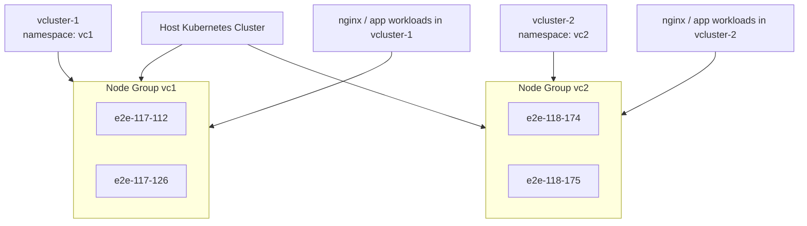

# vCluster Node-Isolation Product Feature

## Objective
Build two vClusters on one host Kubernetes cluster such that:
- `vcluster-1` uses only its assigned node group
- `vcluster-2` uses only its assigned node group
- workloads from one vCluster do not schedule onto the other vCluster’s nodes
- the setup is easy to operate, test, scale, and explain in a demo

This document is written for a junior engineer to implement step by step.

---

## 1. Product Summary

### Problem
A normal vCluster runs on top of a shared host Kubernetes cluster. Without node restrictions, workloads from different vClusters can land on the same worker nodes, causing poor isolation and noisy-neighbor issues.

### Solution
Create dedicated node groups in the host cluster and bind each vCluster to a different node group using:
- node labels
- node taints
- vCluster node sync selectors
- control plane scheduling rules
- workload toleration enforcement

### Result
- `vcluster-1` is isolated to node group `vc1`
- `vcluster-2` is isolated to node group `vc2`
- junior engineers can create, test, and operate the setup using repeatable commands

---

## 2. Final Architecture



---

## 3. Current Node Group Design

### Node Group for `vcluster-1`
- `e2e-117-112`
- `e2e-117-126`

### Node Group for `vcluster-2`
- `e2e-118-174`
- `e2e-118-175`

---

## 4. Key Concepts

### Labels
Used to group nodes logically.

Example:
- `vcluster-group=vc1`
- `vcluster-group=vc2`

### Taints
Used to prevent pods from scheduling unless they explicitly tolerate the taint.

Example:
- `dedicated=vc1:NoSchedule`
- `dedicated=vc2:NoSchedule`

### Tolerations
Used by pods to say they are allowed to run on tainted nodes.

### `sync.fromHost.nodes.selector.labels`
Used by vCluster to decide which host nodes are visible and usable inside a specific vCluster.

### `controlPlane.statefulSet.scheduling`
Used to decide where the vCluster control plane pod itself should run.

---

## 5. Step-by-Step Build Plan

## Step 1: Verify Host Cluster Nodes
Run:

```bash
kubectl get nodes -o wide
```

Expected nodes:

```text
e2e-117-112
e2e-117-126
e2e-118-174
e2e-118-175
```

Success criteria:
- all 4 nodes are `Ready`
- you can identify which 2 belong to `vc1` and which 2 belong to `vc2`

---

## Step 2: Create Dedicated Node Groups Using Labels
Run on the host cluster:

```bash
kubectl label node e2e-117-112 vcluster-group=vc1
kubectl label node e2e-117-126 vcluster-group=vc1

kubectl label node e2e-118-174 vcluster-group=vc2
kubectl label node e2e-118-175 vcluster-group=vc2
```

Verify:

```bash
kubectl get nodes --show-labels | grep vcluster-group
```

Expected result:
- first two nodes show `vcluster-group=vc1`
- last two nodes show `vcluster-group=vc2`

---

## Step 3: Add Taints for Hard Isolation
Run:

```bash
kubectl taint node e2e-117-112 dedicated=vc1:NoSchedule
kubectl taint node e2e-117-126 dedicated=vc1:NoSchedule

kubectl taint node e2e-118-174 dedicated=vc2:NoSchedule
kubectl taint node e2e-118-175 dedicated=vc2:NoSchedule
```

Verify:

```bash
kubectl describe node e2e-117-112 | grep -A3 Taints
kubectl describe node e2e-118-174 | grep -A3 Taints
```

Why this matters:
- pods without the correct toleration will not land on the wrong node group

---

## Step 4: Create Namespace for Each vCluster
Run:

```bash
kubectl create namespace vc1
kubectl create namespace vc2
```

Verify:

```bash
kubectl get ns | grep -E 'vc1|vc2'
```

---

## Step 5: Create `vc1.yaml`

Create file `vc1.yaml`:

```yaml
controlPlane:
  statefulSet:
    scheduling:
      nodeSelector:
        vcluster-group: vc1
      tolerations:
        - key: dedicated
          operator: Equal
          value: vc1
          effect: NoSchedule

sync:
  fromHost:
    nodes:
      enabled: true
      selector:
        labels:
          vcluster-group: vc1
  toHost:
    pods:
      enforceTolerations:
        - dedicated=vc1:NoSchedule

policies:
  networkPolicy:
    enabled: true
```

What this does:
- pins `vcluster-1` control plane to `vc1` nodes
- exposes only `vc1` nodes inside the vCluster
- forces synced workload pods to tolerate `dedicated=vc1:NoSchedule`

---

## Step 6: Create `vc2.yaml`

Create file `vc2.yaml`:

```yaml
controlPlane:
  statefulSet:
    scheduling:
      nodeSelector:
        vcluster-group: vc2
      tolerations:
        - key: dedicated
          operator: Equal
          value: vc2
          effect: NoSchedule

sync:
  fromHost:
    nodes:
      enabled: true
      selector:
        labels:
          vcluster-group: vc2
  toHost:
    pods:
      enforceTolerations:
        - dedicated=vc2:NoSchedule

policies:
  networkPolicy:
    enabled: true
```

---

## Step 7: Create the vClusters
Run:

```bash
vcluster create vcluster-1 --namespace vc1 -f vc1.yaml
vcluster create vcluster-2 --namespace vc2 -f vc2.yaml
```

Verify:

```bash
vcluster list
kubectl get pods -n vc1 -o wide
kubectl get pods -n vc2 -o wide
```

Success criteria:
- both clusters show as running
- control plane pods are scheduled on the correct node groups

---

## Step 8: Verify Node Visibility Inside Each vCluster
For `vcluster-1`:

```bash
vcluster connect vcluster-1 -n vc1
kubectl get nodes
```

Expected:
- only `vc1` nodes are visible

Exit and repeat for `vcluster-2`:

```bash
vcluster connect vcluster-2 -n vc2
kubectl get nodes
```

Expected:
- only `vc2` nodes are visible

---

## Step 9: Deploy Test Application in `vcluster-1`
Create `nginx-vc1.yaml`:

```yaml
apiVersion: apps/v1
kind: Deployment
metadata:
  name: nginx-vc1
spec:
  replicas: 2
  selector:
    matchLabels:
      app: nginx-vc1
  template:
    metadata:
      labels:
        app: nginx-vc1
    spec:
      containers:
        - name: nginx
          image: nginx
          ports:
            - containerPort: 80
```

Apply:

```bash
vcluster connect vcluster-1 -n vc1
kubectl apply -f nginx-vc1.yaml
kubectl get pods -o wide
```

Expected:
- pods are scheduled only on `e2e-117-112` or `e2e-117-126`

Verify from host cluster:

```bash
kubectl get pods -A -o wide | grep nginx-vc1
```

---

## Step 10: Deploy Test Application in `vcluster-2`
Create `nginx-vc2.yaml`:

```yaml
apiVersion: apps/v1
kind: Deployment
metadata:
  name: nginx-vc2
spec:
  replicas: 2
  selector:
    matchLabels:
      app: nginx-vc2
  template:
    metadata:
      labels:
        app: nginx-vc2
    spec:
      containers:
        - name: nginx
          image: nginx
          ports:
            - containerPort: 80
```

Apply:

```bash
vcluster connect vcluster-2 -n vc2
kubectl apply -f nginx-vc2.yaml
kubectl get pods -o wide
```

Expected:
- pods are scheduled only on `e2e-118-174` or `e2e-118-175`

Verify from host cluster:

```bash
kubectl get pods -A -o wide | grep nginx-vc2
```

---

## Step 11: Demo Checklist for Presentation
Use this sequence in your demo:

1. show host nodes
2. show labels and taints
3. show `vc1.yaml` and `vc2.yaml`
4. show both vClusters running
5. connect to `vcluster-1` and show only `vc1` nodes
6. connect to `vcluster-2` and show only `vc2` nodes
7. deploy nginx in each cluster
8. show pods on correct host nodes
9. explain how taints + tolerations create hard isolation

Useful commands:

```bash
kubectl get nodes --show-labels
kubectl describe node e2e-117-112 | grep -A3 Taints
kubectl describe node e2e-118-174 | grep -A3 Taints
vcluster list
kubectl get pods -n vc1 -o wide
kubectl get pods -n vc2 -o wide
kubectl get pods -A -o wide | grep nginx
```

---

## 6. Operations Guide

## Add a New Node to `vcluster-1`
Example: move a new node into `vc1`

```bash
kubectl label node <node-name> vcluster-group=vc1 --overwrite
kubectl taint node <node-name> dedicated=vc1:NoSchedule
```

Verify:

```bash
vcluster connect vcluster-1 -n vc1
kubectl get nodes
```

---

## Remove a Node from `vcluster-1`
Safe sequence:

```bash
kubectl cordon <node-name>
kubectl drain <node-name> --ignore-daemonsets --delete-emptydir-data
kubectl label node <node-name> vcluster-group-
kubectl taint node <node-name> dedicated=vc1:NoSchedule-
```

If node still appears inside vCluster after workloads move, delete stale node object from inside the vCluster:

```bash
vcluster connect vcluster-1 -n vc1
kubectl delete node <node-name>
```

---

## Expose vCluster for Remote Access
If needed later, add service exposure:

```yaml
controlPlane:
  service:
    spec:
      type: LoadBalancer
```

Then upgrade:

```bash
vcluster create --upgrade vcluster-1 -n vc1 -f vc1.yaml
```

Note:
- this depends on the host environment supporting LoadBalancer services
- if not available, use NodePort or Ingress

---

## Upgrade vCluster Safely
Do one cluster at a time.

```bash
vcluster create --upgrade vcluster-1 -n vc1 -f vc1.yaml
vcluster create --upgrade vcluster-2 -n vc2 -f vc2.yaml
```

After upgrade:

```bash
kubectl get pods -n vc1 -o wide
kubectl get pods -n vc2 -o wide
vcluster list
```

---

## 7. Troubleshooting Guide

## Problem: vCluster pod is Pending
Check:

```bash
kubectl get pods -n vc1 -o wide
kubectl describe pod -n vc1 vcluster-1-0
kubectl get pvc -n vc1
```

Common reasons:
- missing toleration for tainted node
- wrong nodeSelector
- no matching labeled nodes
- PVC or storage class issue

---

## Problem: Workload scheduled on wrong node
Check:

```bash
kubectl get pod -A -o wide
kubectl describe node <node-name>
kubectl get nodes --show-labels
```

Common reasons:
- taint missing
- wrong label on node
- tolerations too broad

---

## Problem: Old node still visible in `kubectl get nodes` inside vCluster
Fix:

```bash
kubectl delete node <node-name>
```

Run that command inside the vCluster context.

---

## Problem: LoadBalancer IP not reachable
Check:

```bash
kubectl get svc -n vc1
kubectl describe svc -n vc1
kubectl get endpoints -n vc1
```

Common reasons:
- no working external load balancer in host environment
- firewall or route issue
- service has no endpoints

---

## 8. Acceptance Criteria
This feature is complete when:
- both vClusters are running
- each vCluster shows only its own node group
- each nginx deployment runs only on its assigned node group
- no cross-scheduling is observed
- junior engineer can follow the document without additional help
- architecture can be presented clearly to stakeholders

---

## 9. Commit Plan
Suggested files:

```text
product-feature.md
vc1.yaml
vc2.yaml
nginx-vc1.yaml
nginx-vc2.yaml
```

Suggested commit message:

```bash
git add product-feature.md vc1.yaml vc2.yaml nginx-vc1.yaml nginx-vc2.yaml
git commit -m "Add vCluster node isolation feature design and setup guide"
```

---

## 10. Presentation Script
Use this simple script:

- We had one host Kubernetes cluster with four worker nodes.
- We split those nodes into two groups using labels.
- We enforced hard scheduling boundaries using taints.
- We created two vClusters, each bound to a different node group.
- We validated node visibility inside each vCluster.
- We deployed nginx in both vClusters and verified workloads stayed on the correct nodes.
- This gives us strong multi-tenant isolation while still using one shared host cluster.

---

## 11. Future Enhancements
- add autoscaling per node group
- expose vClusters securely for remote users
- add RBAC-based user onboarding
- add monitoring dashboards per vCluster
- add CI pipeline validation for node-isolation rules

